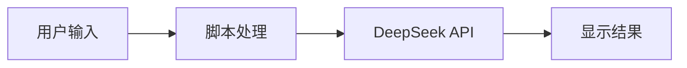
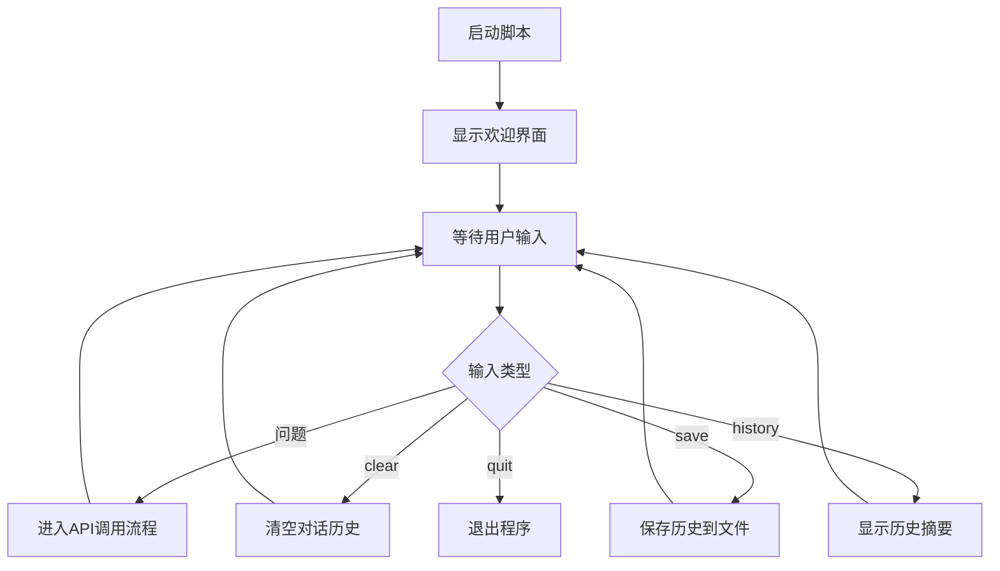
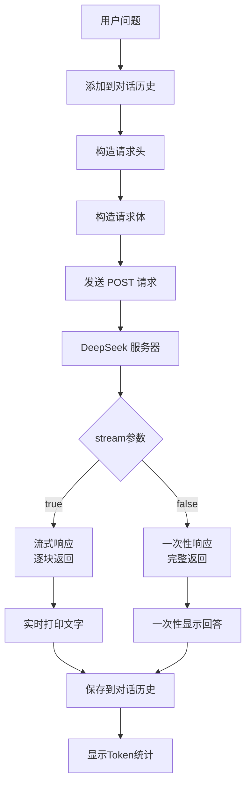
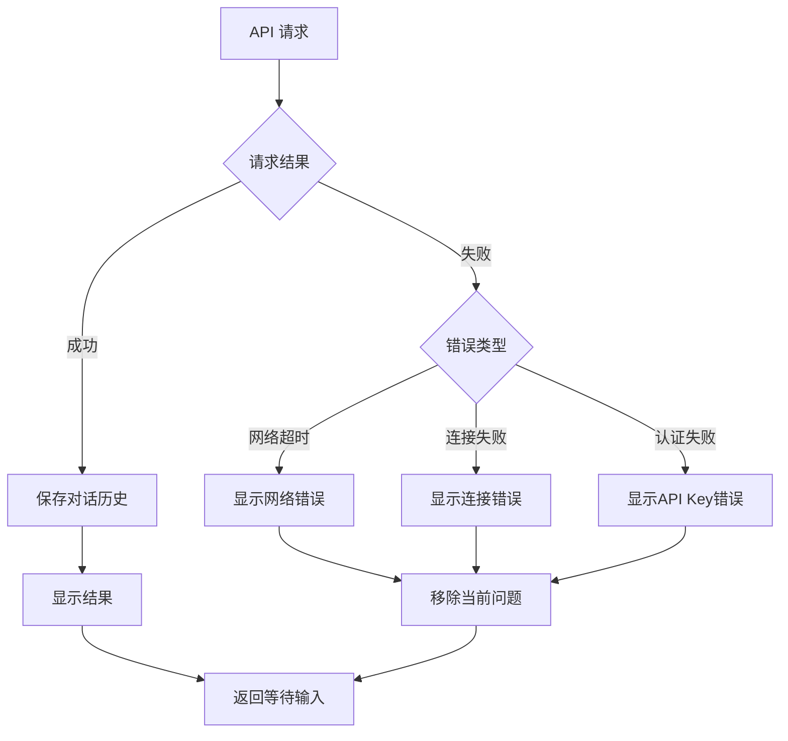

# DeepSeek API 调用程序的数据流向图

以下是用 Mermaid 绘制的 4 张数据流向图，分别展示不同层次的数据流动。

---

## 图1：整体架构图

最精简的版本，只展示核心模块之间的数据流动。

**节点说明**：
| 节点 | 作用 |
|------|------|
| A | 用户在终端输入问题或命令 |
| B | Python 脚本接收、处理、构造请求 |
| C | DeepSeek 云端服务器处理并返回回答 |
| D | 终端显示 AI 回答和统计信息 |

---

## 图2：用户交互与命令处理

只关注用户输入了什么，脚本如何响应。

**节点说明**：
| 节点 | 作用 |
|------|------|
| A | 用户执行 `python api_fetch.py` |
| B | 显示帮助信息和提示 |
| C | 程序等待用户打字输入 |
| D | 判断用户输入的是问题还是命令 |
| E | 普通问题 → 调用 API |
| F/G/H | 各种命令 → 执行对应操作后返回等待 |
| I | 退出 → 结束程序 |

---

## 图3：API 调用与响应

只关注如何调用 DeepSeek API 和接收回答。

**节点说明**：
| 节点 | 作用 |
|------|------|
| A | 用户输入的问题文本 |
| B | 把问题加入 messages 列表 |
| C | 添加 Authorization 和 Content-Type |
| D | 添加 model、messages、stream 等参数 |
| E | 用 requests.post 发送 |
| F | DeepSeek 云端服务器 |
| G | 根据 stream 参数决定返回方式 |
| H/I | 两种不同的响应方式 |
| J/K | 两种不同的显示方式 |
| L | 把 AI 回答保存到历史 |
| M | 打印消耗的 token 数量 |

---

## 图4：错误处理与文件存储

只关注异常情况和数据保存。

**节点说明**：
| 节点 | 作用 |
|------|------|
| A | 向 DeepSeek 发送请求 |
| B | 判断请求成功还是失败 |
| C | 成功时自动保存对话到文件 |
| D | 正常显示 AI 回答 |
| E | 返回主循环，等待下一次输入 |
| F | 失败时判断具体错误类型 |
| G/H/I | 显示不同的错误提示 |
| J | 移除刚添加的问题（避免污染历史） |

---
